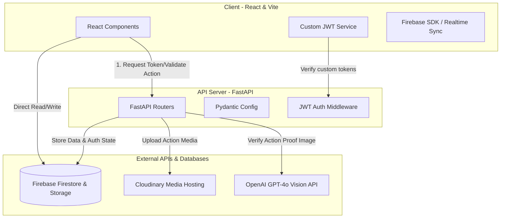

# 🌿 EcoBytes (TerraScore)

[](https://fastapi.tiangolo.com/)
[](https://reactjs.org/)
[](https://vitejs.dev/)
[](https://firebase.google.com/)
[](https://tailwindcss.com/)

**EcoBytes** (commercially branded as **TerraScore**) is a cutting-edge, gamified environmental impact tracking platform. It empowers individuals and organization-backed communities (Corporates, NGOs, Local Clubs) to log daily sustainable activities, calculate carbon offsets, compete on leaderboards, and redeem earned points for real-world eco-rewards. 

The platform features an advanced **AI Proof-of-Action Verification system** powered by GPT-4o Vision to analyze and validate user-submitted proof photos for logged actions.

---

## 🗺️ System Architecture



---

## ✨ Features

- **📊 Personal Impact Dashboard**: Real-time tracking of carbon offset kilograms, points balance, badges, and weekly breakdown charts.
- **⚡ Smart Eco-Action Logging**: Log actions across travel, energy, waste, and food with ease. Includes AI image upload validation.
- **👁️ AI-Powered Action Verification**: Submit proof of actions (e.g. riding a bicycle, composting) which are validated in real-time by a GPT-4o Vision API model.
- **👥 Active Communities**: Create or join corporate, NGO, or local communities. Coordinate sustainability events and track relative impacts on interactive boards.
- **🏆 Live Leaderboards**: Compare impact scores across users globally, locally, or inside specialized communities.
- **🎁 Eco-Rewards Marketplace**: Redeem points for sustainable goods, green vouchers, or to plant physical trees!

---

## 🛠️ Tech Stack

### Backend
- **Framework**: `FastAPI` (Python 3.10+)
- **Database / Storage**: `Firebase Admin SDK` (Firestore Database + Firebase Cloud Storage)
- **Media Optimization**: `Cloudinary API`
- **AI Processing**: `OpenAI SDK` (GPT-4o Vision)
- **Authentication**: Custom JWT authentication (`python-jose` + `bcrypt`)

### Frontend
- **Framework**: `React (v18)` with `TypeScript`
- **Build Engine**: `Vite` (fully configured development reverse proxy)
- **Styling**: `Tailwind CSS` & PostCSS
- **Realtime / Local DB Client**: `Firebase Web SDK`
- **Interactive Maps**: `React Leaflet`

---

## 🚀 Step-by-Step Setup Guide

Follow this guide to get both the backend and frontend up and running locally.

### 📋 Prerequisites

Ensure you have the following installed on your local machine:
- **Node.js** (v18 or higher)
- **Python** (3.10 or higher)
- A **Firebase Project** with Firestore and Storage enabled
- A **Cloudinary** account
- An **OpenAI API Key**

---

### 1. 📂 Repository Setup

Clone the repository and enter the workspace directory:

```bash
git clone https://github.com/PranavVetkar/EcoBytes.git
cd Eco-Bytes
```

---

### 2. 🔌 Backend Setup

Navigate to the `backend` folder, set up a virtual environment, install dependencies, configure environment variables, seed the database, and start the development server.

#### A. Create a Virtual Environment & Install Dependencies

```bash
cd backend
python -m venv .venv
source .venv/bin/activate  # On Windows, use `.venv\Scripts\activate`
pip install -r requirements.txt
```

#### B. Setup Environment Variables

Copy the backend environment template:
```bash
cp .env.example .env
```

Open `.env` and fill in your credentials. Below is a guide on what is needed:
- **`FIREBASE_SERVICE_ACCOUNT_BASE64`**: The base64-encoded string of your Firebase Private Key JSON file.
- **`FIREBASE_PROJECT_ID`**: Your Firebase project ID (e.g., `ecobyte-18dbd`).
- **`FIREBASE_STORAGE_BUCKET`**: Your Firebase storage bucket address (e.g., `ecobyte-18dbd.firebasestorage.app`).
- **`OPENAI_API_KEY`**: Your OpenAI API key for AI action verification.
- **`CLOUDINARY_CLOUD_NAME`**, **`CLOUDINARY_API_KEY`**, **`CLOUDINARY_API_SECRET`**: Obtained from your Cloudinary Dashboard.
- **`JWT_SECRET_KEY`**: Generate a strong random key for signing custom JWT tokens (e.g., using `openssl rand -hex 32`).

> [!TIP]
> **How to Base64 Encode your Firebase Service Account JSON:**
> Run this simple command in your terminal to output the encoded string:
> ```bash
> python -c "import base64; print(base64.b64encode(open('your-firebase-service-account.json','rb').read()).decode())"
> ```
> Copy the output and paste it directly into `FIREBASE_SERVICE_ACCOUNT_BASE64` in `.env`.

#### C. Seed the Database

Before launching, seed the initial community data into your Firestore database:
```bash
python -m scripts.seed_communities
```

#### D. Start the Backend API Server

Run the Uvicorn development server:
```bash
uvicorn app.main:app --reload --port 8000
```
The FastAPI documentation will be interactive and accessible at `http://localhost:8000/docs`.

---

### 3. 💻 Frontend Setup

Navigate to the `frontend` directory, install packages, prepare configuration, and run the Vite dev server.

#### A. Install Packages

```bash
cd ../frontend
npm install
```

#### B. Setup Environment Variables

Copy the frontend environment template:
```bash
cp .env.example .env
```

Open `.env` and fill in your Firebase configuration parameters (these are safe to expose client-side):
- **`VITE_FIREBASE_API_KEY`**
- **`VITE_FIREBASE_AUTH_DOMAIN`**
- **`VITE_FIREBASE_PROJECT_ID`**
- **`VITE_FIREBASE_STORAGE_BUCKET`**
- **`VITE_FIREBASE_MESSAGING_SENDER_ID`**
- **`VITE_FIREBASE_APP_ID`**
- **`VITE_FIREBASE_MEASUREMENT_ID`**

Leave **`VITE_API_BASE_URL`** as `/api/v1`. The Vite server uses this to proxy XHR requests seamlessly to the backend at `http://localhost:8000`, resolving CORS issues in development.

#### C. Run the Development Server

Start Vite:
```bash
npm run dev
```
Open your browser and navigate to the local address displayed (typically **`http://localhost:5173`**).

---

## 🗂️ Project Structure

Below is a bird's-eye view of the codebase layout:

```text
Eco-Bytes/
├── README.md
├── backend/
│   ├── app/
│   │   ├── config.py           # Pydantic environment configuration
│   │   ├── firebase.py         # Async Firestore & Storage Admin initialization
│   │   ├── main.py             # FastAPI App definition & Router mounting
│   │   ├── routers/            # Feature-specific endpoints (users, actions, events)
│   │   ├── models/             # Pydantic representation schemas
│   │   └── services/           # Reusable services (AI verification, custom auth)
│   ├── scripts/
│   │   └── seed_communities.py # Database seeder script
│   ├── .env.example            # Backend config template
│   └── requirements.txt        # Backend dependencies list
└── frontend/
    ├── src/
    │   ├── components/         # Reusable UI widgets (cards, forms, loading indicators)
    │   ├── pages/              # Main view screens (Dashboard, Feed, Leaderboards)
    │   ├── services/           # Network request layers (Axios clients, Auth tokens)
    │   ├── firebase.ts         # Firebase Web client setup
    │   ├── config.ts           # Frontend env config mapper
    │   └── main.tsx            # Application mounting point
    ├── .env.example            # Frontend config template
    ├── tailwind.config.js      # Styling configuration
    └── package.json            # Frontend script & packages runner
```

---

## 🔧 Troubleshooting Common Pitfalls

### 🗝️ Firebase Auth vs JWT Auth
**EcoBytes does not use standard client-side Firebase Auth.** Authentication is powered by our backend custom JWT generator (based on FastAPI & custom credentials).
- If your frontend fails to authenticate, double-check that your `backend/.env` contains valid credentials, and your Firestore instance is fully running and writable.

### 🚫 CORS Errors
If you experience CORS errors when making API calls, verify the `CORS_ORIGINS` variable in your `backend/.env`. It should match the address your Vite frontend is running on (typically `http://localhost:5173`).

### 📦 Base64 Service Account Decoding
If you get `ValueError: Object must be a dict` on backend startup, your `FIREBASE_SERVICE_ACCOUNT_BASE64` is likely incomplete or improperly encoded. Ensure no linebreaks, spaces, or wrapper quotes are present inside the base64 string.

### 🗺️ Leaflet Maps Rendering Grey
If the Leaflet map in the Communities section appears grey or doesn't load tiles properly, ensure your frontend container has set heights and widths defined on parent elements, and check that standard browser CSP permits requests to the openstreetmap tile providers.

---

## 🛡️ License

This project is licensed under the MIT License. See the LICENSE file for details (if applicable).
